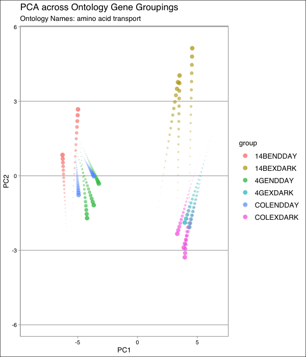

```{r setup, include=FALSE}
knitr::opts_chunk$set(echo = TRUE)
```

```{r message=FALSE, warning=FALSE}
library(BiocManager)
source("rnaseq_utils.R")
library(DESeq2)
library(BiocParallel)
library(ggplot2)
library(dplyr)
library(tidyverse)
library(tidyr)
library(sys)
library(knitr)
library(pheatmap)
```

```{r}
nrow(rnaCounts)
nrow(riboCounts)
```

## rna-seq
```{r}
start_time <- Sys.time()

DESeqDataSet = DESeqDataSetFromMatrix(
    countData = rnaCounts,
    colData = sampleAnnotation,
    design = ~ time + genotype + time:genotype
)

DESeqDataSet = DESeq(
  DESeqDataSet, 
  parallel=FALSE, 
  test = "LRT", 
  reduced = ~ time + genotype
  ) 

DESeq_Results <- results(DESeqDataSet)
# indexes that all have a value 
clean_DESeq_padj <- which(!is.na(DESeq_Results$padj))
sum(DESeq_Results[clean_DESeq_padj, "padj"] <= 0.1)
sum(DESeq_Results[clean_DESeq_padj, "padj"] <= 0.1) * 0.1

end_time <- Sys.time()
print(end_time - start_time)
```

## cut out --> not needed 
```{r}
temp = DESeq_Results[clean_DESeq_padj,]
temp = as.data.frame(temp)
rna_sig_genes = c()
rna_sig_values = c()
for (i in 1:nrow(temp)){
  if (temp$padj[i] <= 0.1){
    rna_sig_genes = c(rna_sig_genes, rownames(temp)[i])
    rna_sig_values = c(rna_sig_values, temp$baseMean[i])
  }
}
```

### log transformed the data
```{r}
lgNorm = log2(counts(DESeqDataSet, normalized=TRUE) + 1)
```

### Overall PCA Plot 
```{r message=FALSE, warning=FALSE}
pca = prcomp(t(lgNorm))
pcaData = data.frame(pca$x[ , 1:2])
pcaData$group = sampleAnnotation[rownames(pcaData), "group"]
pcaData$sample = rownames(pcaData)
gg = ggplot(pcaData, aes(x=PC1, y=PC2, color=group, label=sample))
gg = gg + geom_point(size=2.5, alpha=0.8)
gg = gg + scale_color_manual(values=groupColors)
gg = gg + theme(panel.background = element_rect(fill = 'aliceblue')) 
print(gg)
```


```{r}
# remove the outlier
rnaCounts <- rnaCounts %>% select(-`4GEXDARK4`)
sampleAnnotation <- sampleAnnotation[colnames(rnaCounts),] 
```

```{r}
start_time <- Sys.time()

DESeqDataSet = DESeqDataSetFromMatrix(
    countData = rnaCounts,
    colData = sampleAnnotation,
    design = ~ time + genotype + time:genotype
)

DESeqDataSet = DESeq(
  DESeqDataSet, 
  parallel=FALSE, 
  test = "LRT", 
  reduced = ~ time + genotype
  ) 

DESeq_Results <- results(DESeqDataSet)
clean_DESeq_padj <- which(!is.na(DESeq_Results$padj))
RNA_Sig <- sum(DESeq_Results[clean_DESeq_padj, "padj"] <= 0.1)
RNA_Sig
sum(DESeq_Results[clean_DESeq_padj, "padj"] <= 0.1) * 0.1

end_time <- Sys.time()
print(end_time - start_time)
```

```{r}
temp <- as.data.frame(DESeq_Results[clean_DESeq_padj,])
head(temp %>%  filter(padj <= 0.1) %>% arrange(padj))
```

### log transformed the data
```{r}
lgNorm = log2(counts(DESeqDataSet, normalized=TRUE) + 1)
```

### Overall PCA Plot 
```{r message=FALSE, warning=FALSE}
library(ggplot2)
pca = prcomp(t(lgNorm))
pcaData = data.frame(pca$x[ , 1:2])
pcaData$group = sampleAnnotation[rownames(pcaData), "group"]
pcaData$sample = rownames(pcaData)
gg = ggplot(pcaData, aes(x=PC1, y=PC2, color=group, label=sample))
gg = gg + geom_point(size=2.5, alpha = 0.9)
gg = gg + scale_color_manual(values=groupColors)
gg = gg + theme(panel.background = element_rect(fill = 'aliceblue')) + ggtitle("Overall PCA for RNA-Seq")
print(gg)
```

```{r message=FALSE, warning=FALSE}
joined_set = inner_join(goAssociations, geneNamesAndDescriptions, by = "gene")
ontology_names <- joined_set %>% distinct(gene_ontology_name)
ontology_names <- ontology_names[["gene_ontology_name"]]
ontology_names_all <- goAssociations2 %>% distinct(gene_ontology_name)
ontology_names_all <- ontology_names_all[["gene_ontology_name"]]
```

### PCA based on Gene Groupings
```{r}
for (i in 1:length(ontology_names)){
  temp_set <- joined_set %>% filter(gene_ontology_name == ontology_names[i])
  lgGo <- lgNorm[temp_set$gene, ]
  
  pca1 <- prcomp(t(lgGo))
  pcaData1 = data.frame(pca1$x[ , 1:2])
  pcaData1$group = sampleAnnotation[rownames(pcaData1), "group"]
  pcaData1$sample = rownames(pcaData1)

  gg1 = ggplot(pcaData1, aes(x=PC1, y=PC2, color=group, label=sample))
  gg1 = gg1 + geom_point(size=2.5, alpha=0.8) + ggtitle(ontology_names[i])
  gg1 = gg1 + scale_color_manual(values=groupColors)
  gg1 = gg1 + theme(panel.background = element_rect(fill = 'aliceblue'))
  print(gg1)
}
```

```{r}
all_pca = data.frame()
for (i in 1:length(ontology_names)){
  temp_set <- joined_set %>% filter(gene_ontology_name == ontology_names[i])
  lgGo <- lgNorm[temp_set$gene, ]
  pca1 <- prcomp(t(lgGo))
  pcaData1 = data.frame(pca1$x[ , 1:2])
  pcaData1$group = sampleAnnotation[rownames(pcaData1), "group"]
  pcaData1$sample = rownames(pcaData1)
  pcaData1$ontology_name = ontology_names[i]
  all_pca = rbind(all_pca, pcaData1)
}
write.table(all_pca, 
            "all_pca.csv", 
            sep = ",", row.names = FALSE, quote = FALSE)
```



### Heatmap per Gene Grouping 
```{r}
for (i in 1:length(ontology_names)){
  temp_set <- joined_set %>% filter(gene_ontology_name == ontology_names[i])
  lgGo <- lgNorm[temp_set$gene, ]
  
  heatData = lgGo - rowMeans(lgGo)
  heatData = as.data.frame(heatData)
  heatData[heatData > 2] = 2; heatData[heatData < -2] = -2
  fontsize_row = 10 - nrow(heatData) / 15
  pheatmap(
        heatData,
        color = heatPalette,
        clustering_method = "average", 
        labels_row=geneNamesAndDescriptions[rownames(heatData), "symbol"], 
        main = ontology_names[i], 
        fontsize_row = fontsize_row, 
        cellheight = 5, 
        margins =  c(10, 10)
  )
}
```

#### Specific pHeatmap per Gene Grouping 
```{r}
# "pyruvate metabolic process"
temp_set <- joined_set %>% filter(gene_ontology_name == "pyruvate metabolic process")
lgGo <- lgNorm[temp_set$gene, ]
  
heatData = lgGo - rowMeans(lgGo)
heatData = as.data.frame(heatData)
heatData[heatData > 2] = 2; heatData[heatData < -2] = -2
fontsize_row = 10 - nrow(heatData) / 15
pheatmap(
        heatData,
        color = heatPalette,
        clustering_method = "average", 
        labels_row=geneNamesAndDescriptions[rownames(heatData), "symbol"], 
        main = "pyruvate metabolic process", 
        show_rownames = FALSE
  )
```

```{r}
# "amino acid transport"
temp_set <- joined_set %>% filter(gene_ontology_name == "amino acid transport")
lgGo <- lgNorm[temp_set$gene, ]
  
heatData = lgGo - rowMeans(lgGo)
heatData = as.data.frame(heatData)
heatData[heatData > 2] = 2; heatData[heatData < -2] = -2
fontsize_row = 10 - nrow(heatData) / 15
pheatmap(
        heatData,
        color = heatPalette,
        clustering_method = "average", 
        labels_row=geneNamesAndDescriptions[rownames(heatData), "symbol"], 
        main = "amino acid transport", 
        show_rownames = FALSE
  )
```

```{r}
# "response to light stimulus"
temp_set <- goAssociations2 %>% filter(gene_ontology_name == "response to light stimulus")
lgGo <- lgNorm[temp_set$gene, ]
  
heatData = lgGo - rowMeans(lgGo)
heatData = as.data.frame(heatData)
heatData[heatData > 2] = 2; heatData[heatData < -2] = -2
fontsize_row = 10 - nrow(heatData) / 15
pheatmap(
        heatData,
        color = heatPalette,
        clustering_method = "average", 
        main = "response to light stimulus", 
        show_rownames = FALSE
  )
```

```{r}
# "cellular aldehyde metabolic process"
temp_set <- joined_set %>% filter(gene_ontology_name == "cellular aldehyde metabolic process")
lgGo <- lgNorm[temp_set$gene, ]
  
heatData = lgGo - rowMeans(lgGo)
heatData = as.data.frame(heatData)
heatData[heatData > 2] = 2; heatData[heatData < -2] = -2
fontsize_row = 10 - nrow(heatData) / 15
pheatmap(
        heatData,
        color = heatPalette,
        clustering_method = "average", 
        labels_row=geneNamesAndDescriptions[rownames(heatData), "symbol"], 
        main = "cellular aldehyde metabolic process", 
        show_rownames = FALSE
  )
```

```{r}
# "tetrapyrrole metabolic process"
temp_set <- joined_set %>% filter(gene_ontology_name == "tetrapyrrole metabolic process")
lgGo <- lgNorm[temp_set$gene, ]
  
heatData = lgGo - rowMeans(lgGo)
heatData = as.data.frame(heatData)
heatData[heatData > 2] = 2; heatData[heatData < -2] = -2
fontsize_row = 10 - nrow(heatData) / 15
pheatmap(
        heatData,
        color = heatPalette,
        clustering_method = "average", 
        labels_row=geneNamesAndDescriptions[rownames(heatData), "symbol"], 
        main = "tetrapyrrole metabolic process", 
        show_rownames = FALSE
  )
```


```{r}
clean_DESeq_padj <- which(!is.na(DESeq_Results$padj))
clean_DESeq_Results <- DESeq_Results[clean_DESeq_padj, ]
significant_genes <- rownames(clean_DESeq_Results[which(clean_DESeq_Results[,"padj"] <= 0.1), ])
clean_DESeq_Results <- data.frame(clean_DESeq_Results[which(clean_DESeq_Results[,"padj"] <= 0.1), ])
clean_DESeq_Results$gene <- significant_genes
RNA_Result_groupings <- clean_DESeq_Results %>% inner_join(goAssociations2, by = "gene")
RNA_Result_groupings %>% group_by(gene_ontology_name) %>% summarize(count = n()) %>% arrange(desc(count)) %>% 
  filter(count >= 10) %>% 
  knitr::kable(caption = "Distribution of Significant Genes Groupings for RNA-Seq")
```

```{r}
clean_DESeq_padj <- which(!is.na(DESeq_Results$padj))
clean_DESeq_Results <- DESeq_Results[clean_DESeq_padj, ]
significant_genes <- rownames(clean_DESeq_Results[which(clean_DESeq_Results[,"padj"] <= 0.1), ])
clean_DESeq_Results <- data.frame(clean_DESeq_Results[which(clean_DESeq_Results[,"padj"] <= 0.1), ])
clean_DESeq_Results$gene <- significant_genes
RNA_Result_groupings <- clean_DESeq_Results %>% inner_join(goAssociations2, by = "gene")
RNA_Result_groupings %>% group_by(gene_ontology_name) %>% summarize(count = n()) %>% arrange(desc(count)) %>%
  knitr::kable(caption = "Distribution of Significant Genes Groupings for RNA-Seq")
```

### Strip Charts per Gene Groupings
```{r}
for (i in 1:length(ontology_names)){
  temp_set <- joined_set %>% filter(gene_ontology_name == ontology_names[i])
  lgGo <- lgNorm[temp_set$gene, ]
  
  DESeq_Results1 = DESeq_Results[temp_set$gene, ]
  DESeq_Results1 = DESeq_Results1[order(DESeq_Results1$pvalue), ]
  DESeq_Results1 = DESeq_Results1[1:9, ]
  lgGo1 <- lgNorm[rownames(DESeq_Results1), ]
  stripChart <- stripchart321g(data = lgGo1, 
                               sampleAnnotation = sampleAnnotation, 
                               geneNames = geneNamesAndDescriptions, 
                               colorValues = groupColors 
                               )
  stripChart = stripChart + ggtitle(ontology_names[i])
  stripChart = stripChart + theme(panel.background = element_rect(fill = 'aliceblue'))
  print(stripChart)
}
```


```{r}
# remove the outlier 
riboCounts <- riboCounts %>% select(-`4GEXDARK4`)
sampleAnnotation2 <- sampleAnnotation2[colnames(riboCounts),] 
```

## DEseq with ribo-seq data
```{r}
start_time <- Sys.time()
DESeqDataSet = DESeqDataSetFromMatrix(
    countData = riboCounts,
    colData = sampleAnnotation2,
    design = ~ time + genotype + time:genotype
)

DESeqDataSet = DESeq(
  DESeqDataSet, 
  parallel=FALSE, 
  test = "LRT", 
  reduced = ~ time + genotype
  ) 

DESeq_Results <- results(DESeqDataSet)
clean_DESeq_padj <- which(!is.na(DESeq_Results$padj))
Ribo_Sig <- sum(DESeq_Results[clean_DESeq_padj, "padj"] <= 0.1)
Ribo_Sig
sum(DESeq_Results[clean_DESeq_padj, "padj"] <= 0.1) * 0.1

end_time = Sys.time()
difference = end_time - start_time
difference 
```

```{r}
temp <- as.data.frame(DESeq_Results[clean_DESeq_padj,])
head(temp %>%  filter(padj <= 0.1) %>% arrange(padj))
```

## cut out --> not needed
```{r}
temp = DESeq_Results[clean_DESeq_padj,]
temp = as.data.frame(temp)
ribo_sig_genes = c()
ribo_sig_values = c()
for (i in 1:nrow(temp)){
  if (temp$padj[i] <= 0.1){
    ribo_sig_genes = c(ribo_sig_genes, rownames(temp)[i])
    ribo_sig_values = c(ribo_sig_values, temp$baseMean[i])
  }
}
```

```{r}
lgNormRibo = log2(counts(DESeqDataSet, normalized=TRUE) + 1)
```

```{r message=FALSE, warning=FALSE}
pca = prcomp(t(lgNormRibo))
pcaData = data.frame(pca$x[ , 1:2])
pcaData$group = sampleAnnotation[rownames(pcaData), "group"]
pcaData$sample = rownames(pcaData)

gg = ggplot(pcaData, aes(x=PC1, y=PC2, color=group, label=sample))
gg = gg + geom_point(size=2.5, alpha=0.9)
gg = gg + theme(panel.background = element_rect(fill = 'aliceblue')) + ggtitle("Overall PCA for Ribo-Seq")
print(gg)
```

```{r}
joined_set_ribo = inner_join(goAssociations, geneNamesAndDescriptions, by = "gene")
ontology_names <- joined_set_ribo %>% distinct(gene_ontology_name)
ontology_names <- ontology_names[["gene_ontology_name"]]
```


```{r}
for (i in 1:length(ontology_names)){
  temp_set <- joined_set_ribo %>% filter(gene_ontology_name == ontology_names[i])
  lgGoRibo <- lgNormRibo[temp_set$gene, ]
  
  pca1 <- prcomp(t(lgGoRibo))
  pcaData1 = data.frame(pca1$x[ , 1:2])
  pcaData1$group = sampleAnnotation[rownames(pcaData1), "group"]
  pcaData1$sample = rownames(pcaData1)

  gg = gg + geom_point(size=2.5, alpha=0.9)
  gg = gg + theme(panel.background = element_rect(fill = 'aliceblue'))

  gg1 = ggplot(pcaData1, aes(x=PC1, y=PC2, color=group, label=sample))
  gg1 = gg1 + geom_point(size=2.5, alpha=0.9) + ggtitle(ontology_names[i])
  gg1 = gg1 + theme(panel.background = element_rect(fill = 'aliceblue'))
  print(gg1)
}
```

```{r}
all_pca2 = data.frame()
for (i in 1:length(ontology_names)){
  temp_set <- joined_set_ribo %>% filter(gene_ontology_name == ontology_names[i])
  lgGoRibo <- lgNormRibo[temp_set$gene, ]
  pca1 <- prcomp(t(lgGoRibo))
  pcaData1 = data.frame(pca1$x[ , 1:2])
  pcaData1$group = sampleAnnotation[rownames(pcaData1), "group"]
  pcaData1$sample = rownames(pcaData1)
  pcaData1$ontology_name = ontology_names[i]
  all_pca = rbind(all_pca, pcaData1)
}
write.table(all_pca, 
            "all_pca2.csv", 
            sep = ",", row.names = FALSE, quote = FALSE)
```


## pHeatmap for all ontological groups 
```{r}
for (i in 1:length(ontology_names)){
  temp_set <- joined_set_ribo %>% filter(gene_ontology_name == ontology_names[i])
  lgGo <- lgNormRibo[temp_set$gene, ]
  
  heatData = lgGo - rowMeans(lgGo)
  heatData = as.data.frame(heatData)
  heatData[heatData > 2] = 2; heatData[heatData < -2] = -2
  fontsize_row = 10 - nrow(heatData) / 15
  pheatmap(
        heatData,
        color = heatPalette,
        clustering_method = "average", 
        labels_row=geneNamesAndDescriptions[rownames(heatData), "symbol"], 
        main = ontology_names[i], 
        fontsize_row = fontsize_row, 
        cellheight = 5, 
        margins =  c(10, 10)
  )
}
```


### pHeatmaps for specific groups 
```{r}
# "response to light stimulus"
temp_set <- goAssociations2 %>% filter(gene_ontology_name == "response to light stimulus")
lgGo <- lgNormRibo[temp_set$gene, ]
  
heatData = lgGo - rowMeans(lgGo)
heatData = as.data.frame(heatData)
heatData[heatData > 2] = 2; heatData[heatData < -2] = -2
fontsize_row = 10 - nrow(heatData) / 15
pheatmap(
        heatData,
        color = heatPalette,
        clustering_method = "average", 
        main = "response to light stimulus", 
        show_rownames = FALSE
  )
```

```{r}
# "translation"
temp_set <- goAssociations2 %>% filter(gene_ontology_name == "translation")
lgGo <- lgNormRibo[temp_set$gene, ]
  
heatData = lgGo - rowMeans(lgGo)
heatData = as.data.frame(heatData)
heatData[heatData > 2] = 2; heatData[heatData < -2] = -2
fontsize_row = 10 - nrow(heatData) / 15
pheatmap(
        heatData,
        color = heatPalette,
        clustering_method = "average", 
        main = "translation", 
        show_rownames = FALSE
  )
```

```{r}
# "photosynthesis"
temp_set <- goAssociations2 %>% filter(gene_ontology_name == "photosynthesis")
lgGo <- lgNormRibo[temp_set$gene, ]
  
heatData = lgGo - rowMeans(lgGo)
heatData = as.data.frame(heatData)
heatData[heatData > 2] = 2; heatData[heatData < -2] = -2
fontsize_row = 10 - nrow(heatData) / 15
pheatmap(
        heatData,
        color = heatPalette,
        clustering_method = "average", 
        main = "photosynthesis", 
        show_rownames = FALSE
  )
```

```{r}
# "response to cold"
temp_set <- goAssociations2 %>% filter(gene_ontology_name == "response to cold")
lgGo <- lgNormRibo[temp_set$gene, ]
  
heatData = lgGo - rowMeans(lgGo)
heatData = as.data.frame(heatData)
heatData[heatData > 2] = 2; heatData[heatData < -2] = -2
fontsize_row = 10 - nrow(heatData) / 15
pheatmap(
        heatData,
        color = heatPalette,
        clustering_method = "average", 
        main = "response to cold", 
        show_rownames = FALSE
  )
```

```{r}
# "protein-chromophore linkage"
temp_set <- joined_set_ribo %>% filter(gene_ontology_name == "protein-chromophore linkage")
lgGo <- lgNormRibo[temp_set$gene, ]
  
heatData = lgGo - rowMeans(lgGo)
heatData = as.data.frame(heatData)
heatData[heatData > 2] = 2; heatData[heatData < -2] = -2
fontsize_row = 10 - nrow(heatData) / 15
pheatmap(
        heatData,
        color = heatPalette,
        clustering_method = "average", 
        labels_row=geneNamesAndDescriptions[rownames(heatData), "symbol"], 
        main = "protein-chromophore linkage", 
        show_rownames = FALSE
  )
```

```{r}
# "pyruvate metabolic process"
temp_set <- joined_set_ribo %>% filter(gene_ontology_name == "pyruvate metabolic process")
lgGo <- lgNormRibo[temp_set$gene, ]
  
heatData = lgGo - rowMeans(lgGo)
heatData = as.data.frame(heatData)
heatData[heatData > 2] = 2; heatData[heatData < -2] = -2
fontsize_row = 10 - nrow(heatData) / 15
pheatmap(
        heatData,
        color = heatPalette,
        clustering_method = "average", 
        labels_row=geneNamesAndDescriptions[rownames(heatData), "symbol"], 
        main = "pyruvate metabolic process", 
        show_rownames = FALSE
  )
```


```{r}
for (i in 1:length(ontology_names)){
  temp_set <- joined_set_ribo %>% filter(gene_ontology_name == ontology_names[i])
  lgGo <- lgNormRibo[temp_set$gene, ]
  
  DESeq_Results1 = DESeq_Results[temp_set$gene, ]
  DESeq_Results1 = DESeq_Results1[order(DESeq_Results1$pvalue), ]
  DESeq_Results1 = DESeq_Results1[1:9, ]
  lgGo1 <- lgNormRibo[rownames(DESeq_Results1), ]
  stripChart <- stripchart321g(data = lgGo1, 
                               sampleAnnotation = sampleAnnotation2, 
                               geneNames = geneNamesAndDescriptions, 
                               colorValues = groupColors 
                               )
  stripChart = stripChart + ggtitle(ontology_names[i])
  print(stripChart)
}
```

```{r}
lgNormRibo = log2(counts(DESeqDataSet, normalized=TRUE) + 1)
  
DESeq_Results1 = DESeq_Results[temp_set$gene, ]
DESeq_Results1 = DESeq_Results1[order(DESeq_Results1$pvalue), ]
DESeq_Results1 = DESeq_Results1[1:9, ]
lgGo1 <- lgNormRibo[rownames(DESeq_Results1), ]
stripChart <- stripchart321g(data = lgGo1, 
                               sampleAnnotation = sampleAnnotation2, 
                               geneNames = geneNamesAndDescriptions, 
                               colorValues = groupColors 
                               )
stripChart = stripChart + ggtitle("cold acclimation")
print(stripChart)
```


```{r}
clean_DESeq_padj <- which(!is.na(DESeq_Results$padj))
clean_DESeq_Results <- DESeq_Results[clean_DESeq_padj, ]
significant_genes <- rownames(clean_DESeq_Results[which(clean_DESeq_Results[,"padj"] <= 0.1), ])
clean_DESeq_Results <- data.frame(clean_DESeq_Results[which(clean_DESeq_Results[,"padj"] <= 0.1), ])
clean_DESeq_Results$gene <- significant_genes
RNA_Result_groupings <- clean_DESeq_Results %>% inner_join(goAssociations2, by = "gene")
RNA_Result_groupings %>% group_by(gene_ontology_name) %>% summarize(count = n()) %>% arrange(desc(count)) %>% 
  filter(count >= 6) %>% 
  knitr::kable(caption = "Distribution of Significant Genes Groupings For Ribo-Seq")
```

```{r}
clean_DESeq_padj <- which(!is.na(DESeq_Results$padj))
clean_DESeq_Results <- DESeq_Results[clean_DESeq_padj, ]
significant_genes <- rownames(clean_DESeq_Results[which(clean_DESeq_Results[,"padj"] <= 0.1), ])
clean_DESeq_Results <- data.frame(clean_DESeq_Results[which(clean_DESeq_Results[,"padj"] <= 0.1), ])
clean_DESeq_Results$gene <- significant_genes
RNA_Result_groupings <- clean_DESeq_Results %>% inner_join(goAssociations2, by = "gene")
RNA_Result_groupings %>% group_by(gene_ontology_name) %>% summarize(count = n()) %>% arrange(desc(count)) %>% 
  knitr::kable(caption = "Distribution of Significant Genes Groupings For Ribo-Seq")
```

*Comparison of two mutant types 14B and 4G*
## translational Efficiency pt.2
```{r}
start_time <- Sys.time()

riboCounts <- riboCounts %>% select(-contains("COL"))
rnaCounts <- rnaCounts %>% select(-contains("COL"))
sampleAnnotation <- sampleAnnotation %>% filter(!str_detect(group, 'COL'))
sampleAnnotation2 <- sampleAnnotation2 %>% filter(!str_detect(group, 'COL'))

# rna and ribo 
sampleAnnotation$SeqType = "RNA"
sampleAnnotation2$SeqType = "Ribo"
combinedCounts = cbind(riboCounts, rnaCounts)
sampleAnnotation3 = rbind(sampleAnnotation, sampleAnnotation2)
colnames(combinedCounts) = rownames(sampleAnnotation3)

# time + genotype + time:genotype + SeqType + SeqType:time + SeqType:genotype + SeqType:time:genotype

DESeqDataSet = DESeqDataSetFromMatrix(
    countData = combinedCounts,
    colData = sampleAnnotation3,
    design = ~ time * genotype * SeqType 
)

DESeqDataSet_both = DESeq(
  DESeqDataSet, 
  parallel=FALSE, 
  test = "LRT", 
  reduced = ~ (time + genotype + SeqType)^2
  ) 

DESeq_Results_both <- results(DESeqDataSet_both)
clean_DESeq_padj <- which(!is.na(DESeq_Results_both$padj))
sum(DESeq_Results_both[clean_DESeq_padj, "padj"] <= 0.1)
sum(DESeq_Results_both[clean_DESeq_padj, "padj"] <= 0.1) * 0.1

end_time <- Sys.time()
print(end_time - start_time)

# rna 
DESeqDataSet = DESeqDataSetFromMatrix(
    countData = rnaCounts,
    colData = sampleAnnotation,
    design = ~ time + genotype + time:genotype
)

DESeqDataSet = DESeq(
  DESeqDataSet, 
  parallel=FALSE, 
  test = "LRT", 
  reduced = ~ time + genotype
  ) 

DESeq_Results_RNA <- results(DESeqDataSet)

# ribo 
DESeqDataSet = DESeqDataSetFromMatrix(
    countData = riboCounts,
    colData = sampleAnnotation2,
    design = ~ time + genotype + time:genotype
)

DESeqDataSet = DESeq(
  DESeqDataSet, 
  parallel=FALSE, 
  test = "LRT", 
  reduced = ~ time + genotype
  ) 

DESeq_Results_ribo <- results(DESeqDataSet)
```

```{r}
temp <- as.data.frame(DESeq_Results_both[clean_DESeq_padj,])
head(temp %>%  filter(padj <= 0.1) %>% arrange(padj))
```

```{r}
clean_DESeq_padj <- which(!is.na(DESeq_Results_both$padj))
clean_DESeq_Results <- DESeq_Results_both[clean_DESeq_padj, ]
significant_genes <- rownames(clean_DESeq_Results[which(clean_DESeq_Results[,"padj"] <= 0.1), ])
clean_DESeq_Results <- data.frame(clean_DESeq_Results[which(clean_DESeq_Results[,"padj"] <= 0.1), ])
clean_DESeq_Results$gene <- significant_genes
RNA_Result_groupings <- clean_DESeq_Results %>% inner_join(goAssociations2, by = "gene")
RNA_Result_groupings %>% group_by(gene_ontology_name) %>% summarize(count = n()) %>% arrange(desc(count)) %>% 
  filter(count >= 5) %>% 
  knitr::kable(caption = "Distribution of Significant Genes Groupings For TE")
```

```{r}
clean_DESeq_padj <- which(!is.na(DESeq_Results_both$padj))
clean_DESeq_Results <- DESeq_Results_both[clean_DESeq_padj, ]
significant_genes <- rownames(clean_DESeq_Results[which(clean_DESeq_Results[,"padj"] <= 0.1), ])
clean_DESeq_Results <- data.frame(clean_DESeq_Results[which(clean_DESeq_Results[,"padj"] <= 0.1), ])
clean_DESeq_Results$gene <- significant_genes
RNA_Result_groupings <- clean_DESeq_Results %>% inner_join(goAssociations2, by = "gene")
RNA_Result_groupings %>% group_by(gene_ontology_name) %>% summarize(count = n()) %>% arrange(desc(count)) %>% 
  knitr::kable(caption = "Distribution of Significant Genes Groupings For TE")
```

```{r}
lgNorm = log2(counts(DESeqDataSet_both, normalized=TRUE) + 1)
```

### Overall PCA Plot 
```{r message=FALSE, warning=FALSE}
pca = prcomp(t(lgNorm))
pcaData = data.frame(pca$x[ , 1:2])
pcaData$group = sampleAnnotation3[rownames(pcaData), "group"]
pcaData$sample = rownames(pcaData)
gg = ggplot(pcaData, aes(x=PC1, y=PC2, color=group, label=sample))
gg = gg + geom_point(size=2.5, alpha=0.8)
gg = gg + scale_color_manual(values=groupColors)
gg = gg + theme(panel.background = element_rect(fill = 'aliceblue')) + ggtitle("Overall PCA for Translational Efficiency")
print(gg)
```

```{r}
exclusive = rownames(DESeq_Results_both)[which(DESeq_Results_both$padj < 0.1 & DESeq_Results_ribo$padj < 0.1 & DESeq_Results_RNA$padj > 0.1)]

both = rownames(DESeq_Results_both)[which(DESeq_Results_both$padj < 0.1 & DESeq_Results_ribo$padj < 0.1 & DESeq_Results_RNA$padj < 0.1)]

intensified = both[which(DESeq_Results_both[both,2]*DESeq_Results_RNA[both,2] > 0)]

buffered = both[which(DESeq_Results_both[both,2]*DESeq_Results_RNA[both,2] < 0)]
```

```{r}
goAssociations2 %>% filter(gene %in% exclusive) %>% group_by(gene_ontology_name) %>% summarise(count = n()) %>% 
  arrange(desc(count)) %>% knitr::kable(caption = "Gene Groupings for Exclusive TE Results")

goAssociations2 %>% filter(gene %in% both)  %>% group_by(gene_ontology_name) %>% summarise(count = n()) %>% arrange(desc(count)) %>% knitr::kable(caption = "Gene Groupings for 'Both' TE Results")

goAssociations2 %>% filter(gene %in% intensified) %>% group_by(gene_ontology_name) %>% summarise(count = n()) %>% arrange(desc(count)) %>% knitr::kable(caption = "Gene Groupings for Intensified TE Results")

goAssociations2 %>% filter(gene %in% buffered) %>% group_by(gene_ontology_name) %>% summarise(count = n()) %>% arrange(desc(count)) %>% knitr::kable(caption = "Gene Groupings for Buffered TE Results")
```

```{r}
goAssociations2 %>% filter(gene %in% exclusive) %>% 
  knitr::kable(caption = "Gene Groupings for Exclusive TE Results")
goAssociations2 %>% filter(gene %in% both) %>% 
  knitr::kable(caption = "Gene Groupings for 'Both' TE Results")

goAssociations2 %>% filter(gene %in% intensified) %>% 
  knitr::kable(caption = "Gene Groupings for Intensified TE Results")
goAssociations2 %>% filter(gene %in% buffered) %>% 
  knitr::kable(caption = "Gene Groupings for Buffered TE Results")
```

```{r}
for (id in both){
  ymax=max(DESeq_Results_ribo[id,2],DESeq_Results_RNA[id,2],DESeq_Results_both[id,2],0)
  ymin=min(DESeq_Results_ribo[id,2],DESeq_Results_RNA[id,2],DESeq_Results_both[id,2],0)
  plot(c(0,1), c(0,DESeq_Results_ribo[id,2]), type="l",col="gray", ylim=c(ymin,ymax), 
       ylab="Log2 fold change",xlab="",xaxt="n")
  lines(c(0,1), c(0,DESeq_Results_RNA[id,2]),type="l",col="blue")
  lines(c(0,1), c(0,DESeq_Results_both[id,2]), type="l",col="red")
  legend("bottomleft",c("RNA","Ribo","TE"),fill=c("blue","gray","red"), cex=1, border = NA, bty="n")
  axis(1,at=c(0,1),labels=c(1,2),las=1)
  title(id)
}
```
Intensified and buffered: Genes regulated both by transcriptional and translational regulation (significant ΔRNA, ΔRPFs, and ΔTE) include intensified and buffered genes. These genes are both DTGs and DTEGs.

All lines going in the same direction --> change in translational efficiency is counteracting the change in RNA 

```{r}
for (id in exclusive){
  ymax=max(DESeq_Results_ribo[id,2],DESeq_Results_RNA[id,2],DESeq_Results_both[id,2],0)
  ymin=min(DESeq_Results_ribo[id,2],DESeq_Results_RNA[id,2],DESeq_Results_both[id,2],0)
  plot(c(0,1), c(0,DESeq_Results_ribo[id,2]), type="l",col="gray", ylim=c(ymin,ymax), 
       ylab="Log2 fold change",xlab="",xaxt="n")
  lines(c(0,1), c(0,DESeq_Results_RNA[id,2]),type="l",col="blue")
  lines(c(0,1), c(0,DESeq_Results_both[id,2]), type="l",col="red")
  legend("bottomleft",c("RNA","Ribo","TE"),fill=c("blue","gray","red"), cex=1, border = NA, bty="n")
  axis(1,at=c(0,1),labels=c(1,2),las=1)
  title(id)
}
```

exclusive focuses on findings that are translationally different only. 

```{r}
for (id in intensified){
  ymax=max(DESeq_Results_ribo[id,2],DESeq_Results_RNA[id,2],DESeq_Results_both[id,2],0)
  ymin=min(DESeq_Results_ribo[id,2],DESeq_Results_RNA[id,2],DESeq_Results_both[id,2],0)
  plot(c(0,1), c(0,DESeq_Results_ribo[id,2]), type="l",col="gray", ylim=c(ymin,ymax), 
       ylab="Log2 fold change",xlab="",xaxt="n")
  lines(c(0,1), c(0,DESeq_Results_RNA[id,2]),type="l",col="blue")
  lines(c(0,1), c(0,DESeq_Results_both[id,2]), type="l",col="red")
  legend("bottomleft",c("RNA","Ribo","TE"),fill=c("blue","gray","red"), cex=1, border = NA, bty="n")
  axis(1,at=c(0,1),labels=c(1,2),las=1)
  title(id)
}
```

```{r}
for (id in buffered){
  ymax=max(DESeq_Results_ribo[id,2],DESeq_Results_RNA[id,2],DESeq_Results_both[id,2],0)
  ymin=min(DESeq_Results_ribo[id,2],DESeq_Results_RNA[id,2],DESeq_Results_both[id,2],0)
  plot(c(0,1), c(0,DESeq_Results_ribo[id,2]), type="l",col="gray", ylim=c(ymin,ymax), 
       ylab="Log2 fold change",xlab="",xaxt="n")
  lines(c(0,1), c(0,DESeq_Results_RNA[id,2]),type="l",col="blue")
  lines(c(0,1), c(0,DESeq_Results_both[id,2]), type="l",col="red")
  legend("bottomleft",c("RNA","Ribo","TE"),fill=c("blue","gray","red"), cex=1, border = NA, bty="n")
  axis(1,at=c(0,1),labels=c(1,2),las=1)
  title(id)
}
```
